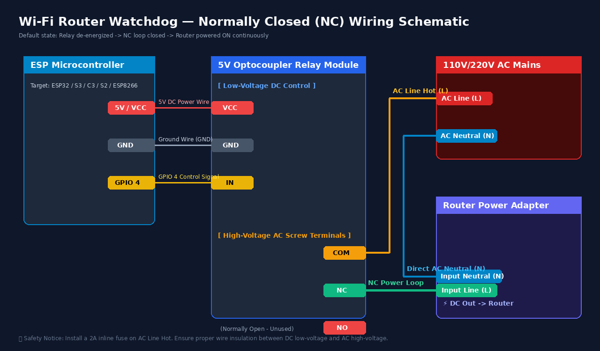
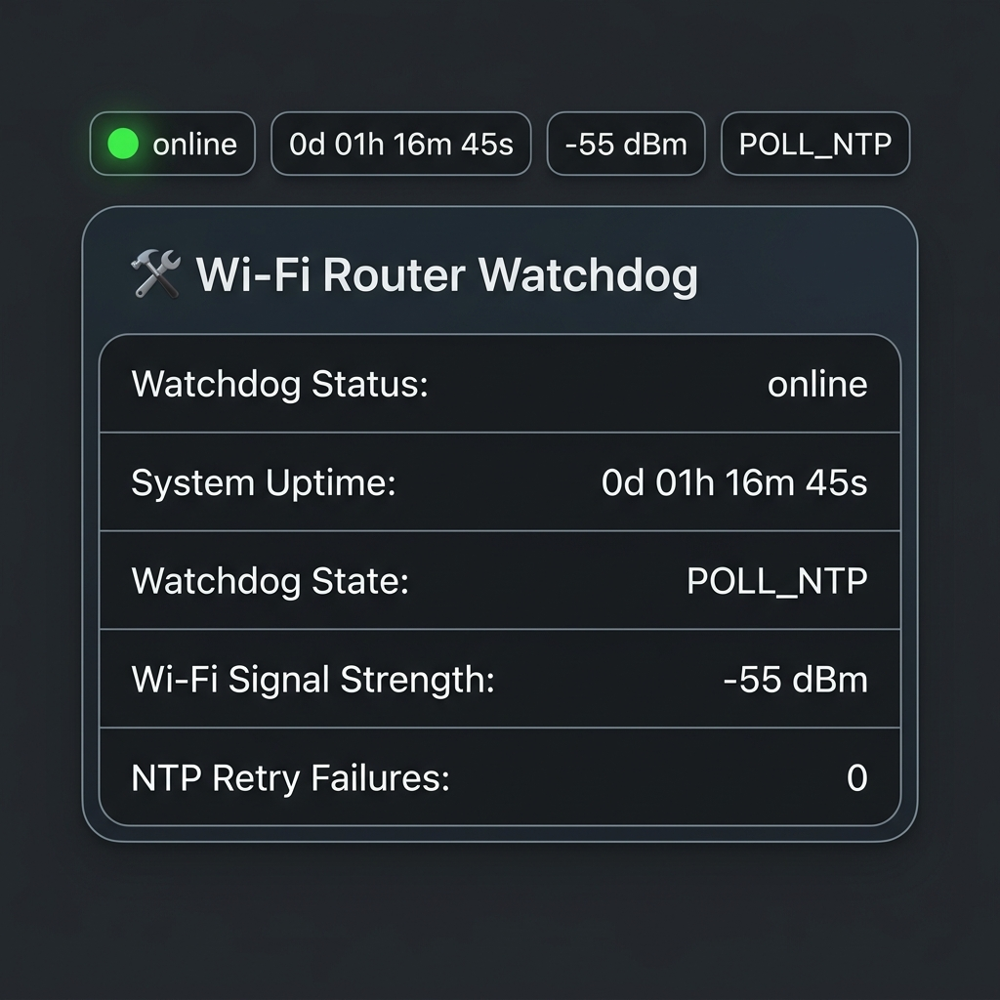

# 🛠️ Wi-Fi Router Watchdog (NTP, ArduinoOTA, Syslog, Web API & Task WDT)

An ESP32 / ESP32-S2 / ESP32-C3 / ESP32-S3 / ESP8266 hardware watchdog that monitors network connectivity via **UDP NTP timestamp queries** and logs watchdog events to a remote **UDP Syslog Server**. If persistent network failures or DNS resolution loss occur (`MAX_RETRY_COUNT = 10`), it power-cycles the router via a relay connected to the **Normally Closed (NC)** power loop, followed by an asynchronous 24-hour cooldown.

---

## 🌟 Key Features

1. **Multi-Architecture Support**:
   - **ESP32-S3 SuperMini** (`esp32-s3-devkitc-1`, 4MB Flash, CDC USB Serial).
   - **ESP32 Standard DevKit** (`esp32dev`, Xtensa Dual-Core).
   - **ESP32-S2 DevKit** (`esp32-s2-saola-1`, Xtensa Single-Core).
   - **ESP32-C3 DevKit** (`esp32-c3-devkitm-1`, RISC-V Single-Core).
   - **ESP8266** (`nodemcuv2`).
2. **Web Server & REST API**:
   - Web Dashboard on Port 80 (`http://<WATCHDOG_IP>/`).
   - JSON REST API endpoint at `http://<WATCHDOG_IP>/status` returning real-time status, uptime, Wi-Fi RSSI, state machine state, and fail counts.
3. **Home Assistant Integration Helper Package**:
   - Ready-to-use Home Assistant package file (`hass/ntp_watchdog.yaml`) with unique sensor IDs.
   - Built-in support for Home Assistant REST & Template Sensors and Lovelace Dashboard cards.
   - Automatic HTTP POST heartbeat client.
4. **Hardware Task Watchdog (WDT)**:
   - Configured with `esp_task_wdt` (ESP32 family) / `ESP.wdtFeed()` (ESP8266) to prevent CPU lockups or firmware freezes.
5. **ArduinoOTA Support**:
   - Wireless over-the-air firmware updates (Hostname: `wifi-router-watchdog`).
6. **Non-Blocking State Machine**:
   - Uses asynchronous `millis()` timing to maintain Wi-Fi, Web Server, ArduinoOTA, and WDT background tasks during the 24-hour cooldown period.
7. **UDP Syslog Remote Logging**:
   - Automatically sends boot, query status, connection timeout, and power cycle logs to remote syslog server.

---

## 📌 Hardware Pinouts & Connections

### ESP32-S3 SuperMini
- **Relay Signal**: `GPIO 4`
- **Status LED**: `GPIO 8` (Onboard LED)
- **USB Interface**: `/dev/ttyACM0` (CDC Serial / JTAG)

### ESP32-C3 DevKit / SuperMini
- **Relay Signal**: `GPIO 4`
- **Status LED**: `GPIO 8`

### ESP32-S2 DevKit
- **Relay Signal**: `GPIO 4`
- **Status LED**: `GPIO 15`

### ESP32 Dev Module
- **Relay Signal**: `GPIO 4`
- **Status LED**: `GPIO 2`

### NodeMCU v2 (ESP8266)
- **Relay Signal**: `D2` (`GPIO 4`)
- **Status LED**: `D4` (`GPIO 2`)

---

## 🔌 Wiring Diagram (Normally Closed / NC Power Loop)

Using the **Normally Closed (NC)** contact ensures that under normal operating conditions (or if the ESP watchdog module loses power or resets), the relay remains closed and AC power flows continuously to the Wi-Fi router.



### ⚡ Circuit Description
1. **Low-Voltage DC Side**:
   - **VCC / GND**: Connect ESP 5V and GND to Relay Module VCC and GND.
   - **Signal (IN)**: Connect ESP `GPIO 4` to Relay `IN`.
2. **High-Voltage AC Side (Normally Closed / NC Loop)**:
   - **COM (Common)**: Connected to the incoming **AC Hot / Line (L)** wire.
   - **NC (Normally Closed)**: Connected to the **Line (L)** terminal of the Wi-Fi router's AC power adapter.
   - **Neutral (N)**: Connected directly from the AC outlet to the router's power adapter.
3. **Behavior**:
   - **Normal Operation (Relay De-energized)**: NC contact is closed $\rightarrow$ AC power flows to router.
   - **Power Cycle Triggered (Relay Energized for 5s)**: Relay pulls NC open $\rightarrow$ AC power to router is cut off for 5 seconds to force hard reboot.

---

## 🚀 Building & Flashing with PlatformIO

Compiling and uploading using PlatformIO inside Distrobox container `resolute`:

### 1. Compile Firmware
```bash
# ESP32-S3 SuperMini
pio run -e esp32-s3-supermini

# ESP32 Standard DevKit
pio run -e esp32dev

# ESP32-S2 DevKit
pio run -e esp32-s2

# ESP32-C3 DevKit
pio run -e esp32-c3

# NodeMCU ESP8266
pio run -e nodemcuv2
```

### 2. Flash via USB Serial
```bash
# Upload to target environment (e.g. ESP32-C3)
pio run -e esp32-c3 -t upload
```

### 3. Wireless OTA Update
```bash
# Upload over Wi-Fi with strong authentication password
export PLATFORMIO_UPLOAD_FLAGS="-a<YOUR_OTA_PASSWORD>"
pio run -e esp32-s3-supermini -t upload --upload-port <WATCHDOG_IP>
```

---

## 🌐 Web Server & REST API Endpoints

- `GET http://<WATCHDOG_IP>/` -> Interactive HTML Web Status Dashboard
- `GET http://<WATCHDOG_IP>/status` -> JSON API:
  ```json
  {
    "status": "online",
    "uptime_seconds": 3600,
    "uptime": "0d 01h 00m 00s",
    "rssi": -52,
    "state": "POLL_NTP",
    "retry_count": 0,
    "max_retries": 10,
    "last_epoch": 1784733276,
    "ip": "192.168.1.100"
  }
  ```
- `GET http://<WATCHDOG_IP>/reboot` -> Triggers ESP restart.

---

## 🏠 Easy Home Assistant Setup Guide

We provide a pre-configured Home Assistant helper package located at [`hass/ntp_watchdog.yaml`](hass/ntp_watchdog.yaml).



### Option A: Using the Package Helper (Recommended)

1. Copy [`hass/ntp_watchdog.yaml`](hass/ntp_watchdog.yaml) into your Home Assistant `/config/packages/` folder.
2. In `hass/ntp_watchdog.yaml`, replace `<WATCHDOG_IP>` with your Watchdog IP address (e.g., `192.168.1.100`).
3. Reload YAML Configuration in **Settings -> Developer Tools -> YAML**.

### Option B: Manual `configuration.yaml` Configuration

Add the following sensors to your Home Assistant `configuration.yaml`:

```yaml
sensor:
  - platform: rest
    name: "NTP Watchdog Status"
    unique_id: ntp_watchdog_status
    resource: "http://<WATCHDOG_IP>/status"
    scan_interval: 10
    timeout: 5
    value_template: "{{ value_json.status }}"
    json_attributes:
      - status
      - uptime_seconds
      - uptime
      - rssi
      - state
      - retry_count
      - max_retries
      - last_epoch
      - ip

template:
  - sensor:
      - name: "NTP Watchdog Uptime"
        unique_id: ntp_watchdog_uptime
        state: "{{ state_attr('sensor.ntp_watchdog_status', 'uptime') }}"
        icon: mdi:clock-outline

      - name: "NTP Watchdog Wi-Fi Signal"
        unique_id: ntp_watchdog_wifi_signal
        state: "{{ state_attr('sensor.ntp_watchdog_status', 'rssi') }}"
        unit_of_measurement: "dBm"
        device_class: signal_strength
        icon: mdi:wifi

      - name: "NTP Watchdog State"
        unique_id: ntp_watchdog_state
        state: "{{ state_attr('sensor.ntp_watchdog_status', 'state') }}"
        icon: mdi:chip

      - name: "NTP Watchdog Fail Count"
        unique_id: ntp_watchdog_fail_count
        state: "{{ state_attr('sensor.ntp_watchdog_status', 'retry_count') }}"
        icon: mdi:alert-circle-outline
```

### 🎨 Adding the Dashboard Card

Copy the following YAML into your Home Assistant Lovelace Dashboard (**Add Card -> Manual**):

```yaml
type: entities
title: "🛠️ Wi-Fi Router Watchdog"
show_header_toggle: false
entities:
  - entity: sensor.ntp_watchdog_status
    name: Watchdog Status
    icon: mdi:check-circle-outline
  - entity: sensor.ntp_watchdog_uptime
    name: System Uptime
    icon: mdi:clock-outline
  - entity: sensor.ntp_watchdog_state
    name: Watchdog State
    icon: mdi:chip
  - entity: sensor.ntp_watchdog_wifi_signal
    name: Wi-Fi Signal Strength
    icon: mdi:wifi
  - entity: sensor.ntp_watchdog_fail_count
    name: NTP Retry Failures
    icon: mdi:alert-circle-outline
```
